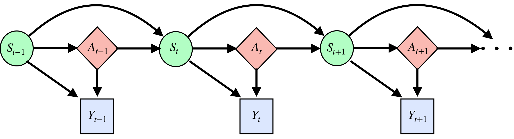
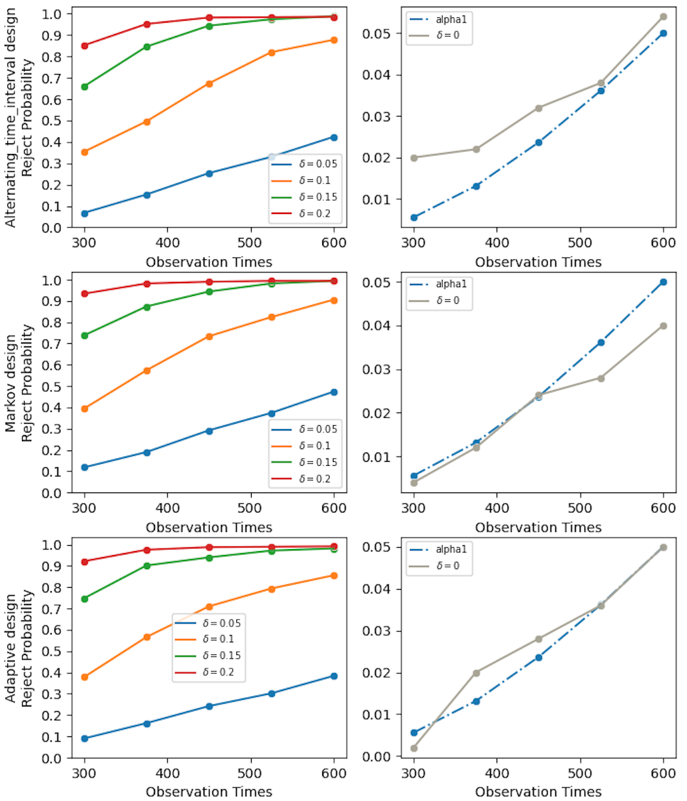
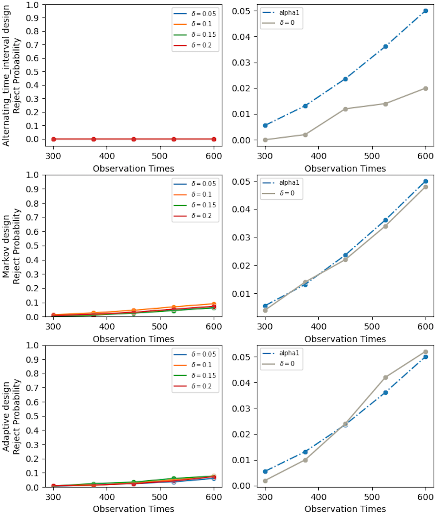
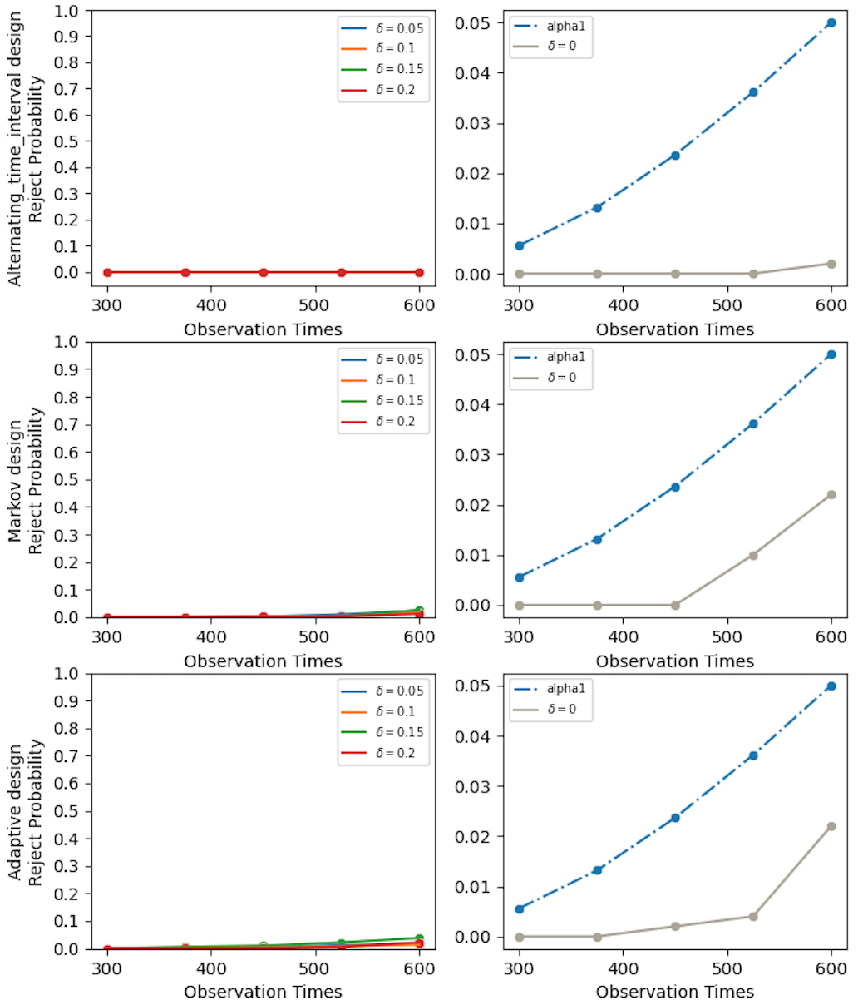

# Time Dependent Causal Effects Evaluation in A/B Testing with a Reinforcement Learning Framework (CausalRL)

This repository contains the implementation for the paper ["Time Dependent Causal Effects Evaluation in A/B Testing with a Reinforcement Learning Framework"](https://arxiv.org/pdf/2002.01711.pdf) in Python. 

## Summary of the paper

A/B testing, or online experiment is a standard  business strategy to compare a new product with an old one in pharmaceutical, technological, and traditional industries.  Major challenges arise in online experiments of two-sided marketplace platforms (e.g., Uber) 
where there is only one unit that receives a sequence of treatments over time. In those  experiments, the treatment at a given time   impacts  current outcome as well as future outcomes. The aim of this paper is to  introduce a reinforcement learning framework for carrying A/B testing in these experiments, while characterizing the long-term treatment effects. Our proposed testing procedure allows for sequential monitoring and online updating. It is generally applicable to a variety of treatment designs in different industries. In addition, we systematically investigate the theoretical properties (e.g., size and power) of our testing procedure. Finally, we apply our framework to both simulated data and a real-world data example obtained  from a technological company to illustrate its advantage over the current practice. 



**Figure 1**: Causal diagram for MDP under settings where treatments depend on current states only. $(S_t,A_t,Y_t)$ represents the state-treatment-outcome triplet. Solid lines represent causal relationships. 

<p float="left">
 


</p>


## Citation

Please cite our paper
["Time Dependent Causal Effects Evaluation in A/B Testing with a Reinforcement Learning Framework"](https://arxiv.org/pdf/2002.01711.pdf)

``` 
@article{shi2021time,
  title={Time Dependent Causal Effects Evaluation in A/B Testing with a Reinforcement Learning Framework},
  author={Shi, Chengchun and Wang, Xiaoyu and Luo, Shikai and Zhu, Hongtu and Ye, Jieping and Song, Rui},
  journal={Journal of the American Statistical Association},
  volume={accepted}
  year={2021}
}
``` 
